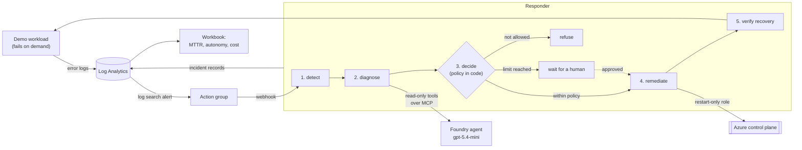

# Self-healing AIOps

An incident pipeline where an AI agent diagnoses the fault, **policy decides whether it may be fixed unattended**, the fix is verified, and every incident is measured in time-to-recovery and dollars.

A workload starts failing. An Azure alert notices. An agent investigates with read-only tools and proposes at most one remediation. Code — not the model — decides whether that proposal runs now, waits for a person, or is refused outright. The fix is applied with an identity that can do exactly one thing, then the workload is re-checked before the incident is called resolved.



## What this demonstrates

| Area | How it's done here |
|---|---|
| **Autonomy with a leash** | Unattended action requires three things at once: a known action, a managed resource, and remaining budget for the day. Miss any one and the incident waits for a person. The model's confidence is deliberately not an input. |
| **The agent cannot act** | It holds read-only tools. Every tool call returns for approval and the responder refuses anything that isn't a read. Remediation is a separate code path using a different identity. |
| **Least privilege at the edge** | That identity holds one custom role whose only action is `Microsoft.App/containerApps/revisions/restart/action`. A compromised responder still cannot change an app, its image, or its secrets. |
| **Measured, not asserted** | Each incident records detection, diagnosis, decision, remediation and verification timestamps, the tools used, tokens spent and the dollar cost. MTTR and the unattended rate come from those records. |
| **Verification, not optimism** | An incident is "resolved" only after the workload serves traffic again. If it doesn't, the incident ends `unresolved` and says so. |
| **Reuse across labs** | Observability and Key Vault come from the [landing zone lab](https://github.com/zuqdah/azure-agent-landing-zone); the Foundry module and the MCP tool server image come from the [agentic ops copilot](https://github.com/zuqdah/agentic-ops-copilot). All pinned to commits. |

## The decision

Policy lives in `apps/responder/policy.py`, in about forty lines, and is the most-tested code in the repository.

| Situation | Outcome |
|---|---|
| Known action, managed resource, under the daily limit | **auto** — runs unattended |
| Daily limit reached for that resource | **escalate** — a repeatedly failing app needs a person, not another restart |
| Action the responder cannot perform (`delete_resource_group`, anything unrecognized) | **refuse** — approving it would be meaningless |
| A resource this responder doesn't manage | **refuse** |
| No action proposed | **refuse** |

Escalated incidents wait at `POST /incidents/{id}/approve`, which requires a key. That endpoint is the human in the loop.

## The incident record

Every state change is emitted as one JSON line, which is what the dashboard reads:

```json
{"event": "incident", "id": "9f2c1a...", "status": "resolved",
 "alert": "5xx rate above threshold", "target": "ca-aiops-x1y2z-demo",
 "diagnosis": "The workload is returning 500s from /api/work and its logs show repeated request_failed entries...",
 "proposed_action": "restart_container_app", "confidence": "high",
 "decision": "auto", "decision_reason": "restart_container_app on ... is within policy (0/3 today)",
 "tools_used": ["container_app_status", "query_logs"],
 "prompt_tokens": 3184, "completion_tokens": 212, "cost_usd": 0.003678,
 "mttr_seconds": 41.2, "healed": true}
```

The workbook turns these into three tiles: the incident list, mean time to recovery, and autonomy rate with diagnosis cost.

## Repository layout

```
bootstrap/            One-time setup: state, GitHub OIDC identity, restart-only role
infra/                Foundry project, three apps, identities, alert rule, workbook
modules/
  container-app/      Generic container app with Key Vault-backed secrets
  incident-alert/     Log search alert rule and the action group that calls the responder
apps/
  demo/               The workload that can be broken, and its tests
  responder/          Detect, diagnose, decide, remediate, verify, and its tests
agents/               The diagnosing agent, defined as code
.github/workflows/    CI, Deploy (manual), Destroy (manual + nightly)
```

## Cost

Pay-as-you-go rates, East US 2, September 2026.

| Resource | Lab cost |
|---|---|
| Foundry prompt agent | No charge beyond tokens |
| gpt-5.4-mini diagnosis | Fractions of a cent per incident, recorded per incident |
| Container Apps | The demo and responder hold one replica each so faults and incidents survive; the tool server scales to zero |
| Log search alert rule | Cents per month |
| Log Analytics, Key Vault, workbook | Within the free grant; ingestion capped at 0.1 GB/day |

Deploys are manual, and the nightly teardown removes everything at 07:00 UTC.

## How to run it

**Prerequisites:** Terraform 1.9+, Azure CLI, an Azure subscription where you're Owner, and a fork of this repository.

1. **Bootstrap** (once), after creating the repository so its IDs exist:
   ```bash
   az login
   cd bootstrap
   terraform init
   terraform apply \
     -var='github_repository=<owner>/<repo>' \
     -var="github_repository_owner_id=$(gh api repos/<owner>/<repo> --jq .owner.id)" \
     -var="github_repository_id=$(gh api repos/<owner>/<repo> --jq .id)"
   ```
2. **Configure GitHub.** Create an environment named `lab` and add the repository variables from the bootstrap outputs: `AZURE_CLIENT_ID`, `AZURE_TENANT_ID`, `AZURE_SUBSCRIPTION_ID`, `TFSTATE_RESOURCE_GROUP`, `TFSTATE_STORAGE_ACCOUNT`, `TFSTATE_CONTAINER`, `LAB_RESOURCE_GROUP`, `RESTART_ROLE_DEFINITION_ID`. None are secrets.
3. **Deploy.** Run the **Deploy** workflow. It builds both apps, applies Terraform, publishes the agent, then breaks the workload for real and requires that it comes back. Tick `wait_for_real_alert` to also wait for Azure Monitor to notice the fault on its own.
4. **Try it by hand.**
   ```bash
   curl -X POST "$DEMO_URL/break"      # start failing
   curl "$DEMO_URL/api/work"           # 500
   curl "$RESPONDER_URL/incidents"     # watch the incident progress
   ```
5. **Tear down.** Run **Destroy**, or let the nightly schedule do it.

## Design decisions

- **The agent diagnoses; code decides.** Letting a model approve its own action is not a control. Policy is ordinary code with unit tests, and it reads the agent's proposal as untrusted input, including which resource the proposal names.
- **A daily budget, not a confidence threshold.** An app that fails four times in a day has a problem a restart won't fix. The limit turns a potential restart loop into an escalation.
- **The fault is in memory on purpose.** A restart genuinely clears it, so the remediation is real rather than simulated. The health probe deliberately stays green while the app is broken; otherwise the platform would restart it before any alert fired and the lab would prove nothing.
- **A path token on the webhook.** Azure Monitor's plain webhooks can't send custom headers, so the shared secret is in the URL path and the endpoint does nothing without it. A secure webhook with an Entra identity is the production step.
- **Verification is an HTTP check, not a status field.** The workload has to answer a real request before the incident closes.

## Part of a series

Built on the [Azure agent landing zone](https://github.com/zuqdah/azure-agent-landing-zone) and the [agentic ops copilot](https://github.com/zuqdah/agentic-ops-copilot). More at [ziyaduqdah.com](https://ziyaduqdah.com/#labs).
